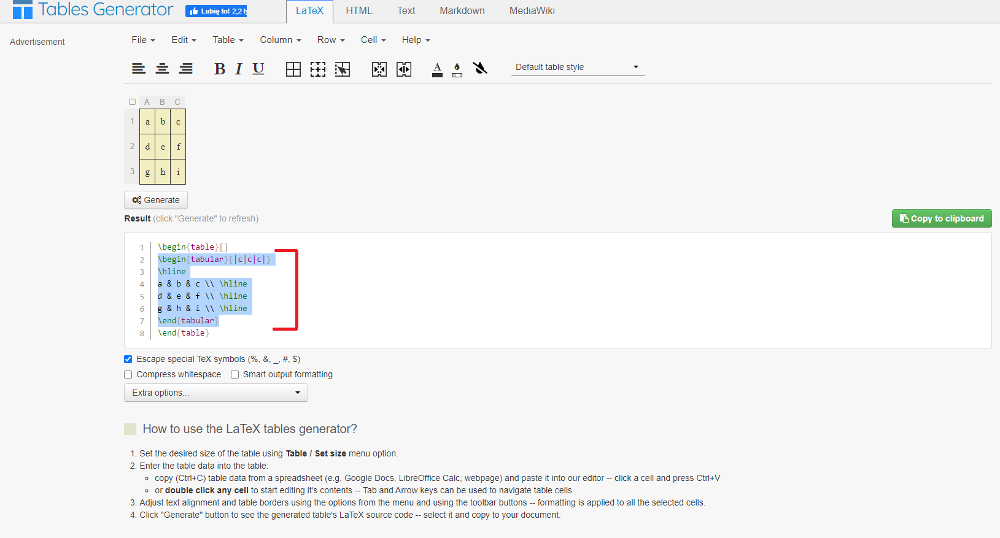
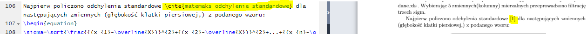

# LaTeX poradnik

## Wstęp
### Przedmowa
> Nie wiem na razie czym ma być ten twór, na razie planuję aby był to zbiór różnych rzeczy do LaTeX-a. Całość chcę podzielić na tematyczne rozdziały.
>
> Nie jest to taki poradnik dla początkujących, ale jest szansa, że zrobię wersje w dodatkiem dla początkujących, bo LaTeX fajny jest. Dlatego czasami coś tłumaczę a czasami nie.
>
> Całość wstawek LaTeX-owych dodam jeszcze w osobnym pliku aby można było mieć wszystkie przydatne śmieci pod ręką.

### Parę zdań o LaTeX
> Tutaj coś napiszę o takich ostrych podstawach
>
> Zawartość naszego sprawka lub dokumentacji na konkurs, w którym Turcy robią manewr wykopania (absolutnie losowy przykład) musi  być między blokiem:
>
> ```latex
> \begin{document}
> Zawartość
> \end{document}
> ```
>
>  
>
> Nową stronę robimy przy pomocy:
>
> ```latex
> \newpage
> ```
>
> 

## Spis treści:

>[TOC]
>
>

## Biblioteki

> Generalnie im "więcej tym, nic się nie stanie". Polecam mieć już szablon używanych bibliotek.
>
> Moje biblioteki są do wielu rzeczy i rzadko trzeba jakąś jeszcze dodać.
>
> ```latex
> \documentclass{article}
> \usepackage[utf8]{inputenc}
> \usepackage{polski}
> \usepackage{amssymb}
> \usepackage{wasysym}
> \usepackage{graphicx}
> \usepackage[polski]{babel}
> \usepackage{multirow}
> \usepackage{multicol}
> \usepackage[table,xcdraw]{xcolor}
> \usepackage[shortlabels]{enumitem}
> \usepackage{bm}
> \usepackage[top=1.5cm, bottom=1.5cm, left=1.7cm, right=1.7cm]{geometry}
> \usepackage{blindtext}
> \usepackage{hyperref}
> \usepackage{float}
> \usepackage{wrapfig}
> ```
>
> 

## Zdjęcia
### Co i jak

> [Do poczytania](https://www.overleaf.com/learn/latex/Inserting_Images)
>
> Najważniejsza rzecz w sumie i najpiękniejsze co LaTex oferuje, już nigdy (prawie) zdjęcie nie rozwali Ci całego sprawka jak jakiś tam Word. 
>
> Wrzucanie zdjęć to żadna filozofia
>
> ```latex
> \begin{figure}[h!]
> \centering
> \includegraphics[width=0.45\textwidth, angle = 0]{./picture.png}
> \captionsetup{labelformat=empty}%jak nie chcesz mieć przy opisie napisane "Figure *numer*" to pozostaw odkomentowane
> \label{fig:etykietka}
> \caption{podpis}%chyba nie muszętłumaczyć xD
> \end{figure}
> ```
> `\label{fig:etykietka}` można robić etykiety do otoczenia `figure` dzięki czemu można robić ich cytowanie (chyba rzadko używane), ja nie korzystam z tego, a Płachtuś i Kruk chwalili.
>
>
> ```latex
> \captionsetup{labelformat=empty}
> ```
> jak nie chcesz mieć przy opisie napisane "Figure *numer*" to pozostaw odkomentowane
>
> ```latex
> \label{fig:etykietka}
> ```
>
> każde zdjęcie/ otoczenie **figure** może mieć swoją etykietę, wygodne przy odnoszeniu się do zdjęć, można sprawę olać w wielu przypadkach
>
> ```latex
> \caption{podpis}
> ```
>
> chyba nie muszę tłumaczyć xD
>
> ______
>
> `angle = 0` kąt o jaki obracać obrazek
>
> w sekcji `\includegraphic`można też dodać na sztywno szerokość i wysokość:
>
> ```latex
> \includegraphics[width=3cm, height=4cm, angle = 0]{./picture.png}
> ```
> 
> jest też wersja super biedacka co czasami uratuje wam pupę, w sensie wpisz tylko to i też pojawi się zdjęcie:
> 
> ```latex
> \includegraphics[width=0.45\textwidth, angle = 0]{./picture.png}
> ```
>
> W pierwszej linijce mamy też taką literkę w nawiasach:
>
> ```latex
> \begin{figure}[H!]
> ```
>
> Można tam dać różne literki, lista co one oznaczają:
>
> * `h` tam gdzie w kodzie
> * `t` top, w sensie góra (nie chcę tu z nikogo głąba robić, no ale co kurde miałem napisać)
> * `b` bottom, w sensie dół
> * `p` jakaś specjalna strona
> * `!` z ang. **override** , a po polskiego to olanie wytycznych
> * `H` jakieś lepsze od `h` , wymagane `\usepackage{float}`
>
> _________
### DOUBLE zdjęcia 

>```latex
>\begin{figure}[h!]
>     \centering
>     \begin{subfigure}[b]{0.45\textwidth}
>         \centering
>         \includegraphics[width=\textwidth]{pictures/Zad 2/2c.PNG}
>         \caption{Układ z diodą 1N1183}
>         \label{fig:y equals x}
>     \end{subfigure}
>     \hfill
>     \begin{subfigure}[b]{0.45\textwidth}
>         \centering
>         \includegraphics[width=\textwidth]{pictures/Zad 2/2c1.PNG}
>         \caption{Wykres dla układu zawierającego diodę 1N1183}
>         \label{fig:three sin x}
>     \end{subfigure}
>\end{figure}
>```
>
>

## Tabelki
### Wstęp
> W sumie to mięsko LaTeX-a, genialne tabelki. Proszę nie słuchać jakiś opinii, że to nie działa, że tabelki to gówno i że się je klepie jak zwierzę.
>
> Zapamiętaj:
> Do LaTeX-a używa się [generatora tabel](https://www.tablesgenerator.com/latex_tables).
>
> **Protip:** Nie koloruj tabelek w Excelu jak przeklejasz, bo się kolorki wysypują.
### Jak to wrzucać w ogóle

> ```latex
> \begin{table}[h!]
> \begin{center}
> \resizebox{0.8\textwidth}{!} {
> 
> \begin{tabular}{|c|c|c|}
> \hline
> a & b & c \\ \hline
> d & e & f \\ \hline
> g & h & i \\ \hline
> \end{tabular}
> 
> }
> \end{center}
> \end{table}
> ```
>
> 
>
> [h1] <- czyli tabelka będzie tam gdzie chcemy
>
> Z generatora wklejamy tylko to co jest w otoczeniu **table** reszta jak z kodu wyżej.
>
> * Dlaczego?
> * Nie wiem, wiem tylko że jak chcę skalować tabelki to tylko tak to działa xD

### Co gdy LaTeX postanowi spierdolić twoją tabletkę

**$\sim$ Dzięki Damian za pomoc z tym**

> Dzisiaj przy sprawku już by fikołek leciał, okazało się, że generator tabel, czyli nie LaTeX -a wina<3 
>
> ```latex
> \begin{table}[h!]
> \begin{center}
> \resizebox{0.8\textwidth}{!} {
> \begin{tabular}{|c|c|c|c|c|}
> \hline
> \rowcolor[HTML]{76DE26} 
> I       & U    & VM1  & VM2 & R1         \\ \hline %<-- ten \hline mi rozwalił wszystko, wrrr...
> \rowcolor[HTML]{76DE26} 
> [mA]    & [V]  & [V]  & [V] & $[\Omega]$ \\ \hline
> 0,00107 & 2,25 & 2,25 & 0,6 & 560        \\ \hline
> 0,00036 & 0,75 & 0,75 & 0,2 & 560        \\ \hline
> 0,00268 & 0,4  & 0,4  & 1,5 & 560        \\ \hline
> 0,00000 & 0    & 0    & 0   & 560        \\ \hline
> \end{tabular}
> }
> \end{center}
> \end{table}
> ```
> Powinno być tak:
>
> ```TeX
> \begin{table}[h!]
> \begin{center}
> \resizebox{0.8\textwidth}{!} {
> \begin{tabular}{|c|c|c|c|c|}
> \hline
> \rowcolor[HTML]{76DE26} 
> I       & U    & VM1  & VM2 & R1         \\ 
> \rowcolor[HTML]{76DE26}
> \hline %<-- powinien być tutaj
> [mA]    & [V]  & [V]  & [V] & $[\Omega]$ \\ \hline
> 0,00107 & 2,25 & 2,25 & 0,6 & 560        \\ \hline
> 0,00036 & 0,75 & 0,75 & 0,2 & 560        \\ \hline
> 0,00268 & 0,4  & 0,4  & 1,5 & 560        \\ \hline
> 0,00000 & 0    & 0    & 0   & 560        \\ \hline
> \end{tabular}
> }
> \end{center}
> \end{table}
> ```
>
> 

### Co gdy LaTeX postanowi wypierdolić twoją tabletkę/zdjęcie 3 strony dalej

**$\sim$ z dedykacją dla Michała**

> Po pierwsze przypominam o **[h!]**
>
> Na takie zjawisko składać się może kilka powodów, od razu zaznaczam że Word nie jest lepszy w tym. LaTeX ma powody aby coś odwalić.
>
> Najczęściej chodzi o rozmiar i tu mowa o szerokości jak i wysokości, w każdym z tych przypadków będzie problem.
>
> Aby sobie temu zaradzić polecam dać **\newpage** przed tabelką aby upewnić się, że z samą tabelką nie ma żadnego problemu jeśli chodzi o jej kształt. Jeśli wtedy się wysypie to pewnie tabelka jest zła.
>
> Naprawdę mało jest przypadków, że tabelka żyje swoim życiem i prawie zawsze chodzi o rozmiar.

## Bibliografia
### Co to, po co i dlaczego?
>Bibliografia przydaję się w dwóch przypadkach:
>
>* masz laby akustyki z Krukiem
>* piszesz inżynierkę
>
>W pozostałych przypadkach dajesz link w nawiasie i każdy jest zadowolony
>
>Bajer cytowania polega na wstawieniu kwadratowego nawiasu z numerkiem [1] i podciąganie pod numerek odpowiedniej pozycji
>
>Nie wiem po co to napisałem ale nie było to bez sensu więc zostawiłem.

### Jak to wrzucać w ogóle
>Po pierwsze musimy stworzyć plik z naszymi pozycjami naukowymi.
>
>Nazwa pliku to:  **twoja_nazwa.bib**
>
>Struktura każdej pozycji zawiera elementy takie jak tytuł, autor, sposób publikacji,notatka (często tzw. dostęp)
>
>```latex
>@misc{matemaks_odchylenie_standardowe,
>    title={Odchylenie standardowe},
>    author={ Michał Budzyński},
>    howpublished = {\href{https://www.matemaks.pl/odchylenie-standardowe.html}{matemaks.pl}},
>    note = {dostęp: 2020-01-03}
>}
>
>@misc{regula_trzech_sigm,
>    title={Reguła trzech sigm},
>    author={naukowiec org},
>    howpublished = {\href{https://www.naukowiec.org/wiedza/statystyka/regula-trzech-sigm_709.html}{naukowiec.org}},
>    note = {dostęp: 2020-01-03}
>}
>```
>
>**@misc** to nazwa przypisu, coś jak nazwa zmiennej czy #define w C, jej używamy aby odwołać się w teksie do przypisu. Tutaj też ważna sprawa że zawartość tego pliku jest niejako wklejana do końcowego tekstu, czego powodem jest zachowanie uwagi na składnie, czasami trzeba samemu sformatować link
>
>Przypis dodajemy wrzucając w pisany tekst wstawkę/komendę/funkcję(ty bardziej słowo wywołać pasuje):
>
>``` late
>\cite{matemaks_odchylenie_standardowe}
>```
>
>
>
>
>
>
>
>Samą bibliografię trzeba jeszcze wstawić w sensie rozpiskę, taką przeformatowaną zawartość **twoja_nazwa.bib**. Robi się to najczęściej na końcu wstawką:
>
>```latex
>\bibliography{twoja_nazwa}%tutaj załączamy nasz plik z bibliografią
>\bibliographystyle{IEEEtran}%plain %<- jest to rodzaj bibliografii
>```

## Zapis matematyczny
### Skąd mieć wiedzę jak to pisać w ogóle
>No generalnie przez praktykę i podręczne dokumenty.
>
>Teraz Wordowe świry mogą powiedzieć, że oni mają takie fajnie do klikania te formuły matematyczne no  ale to nie dość, że działa średnio to nic z tym poza Wordem nie zrobisz.
>
>Polecane źródła:
>
>* [do wyklikania](http://www.hostmath.com/) <- i już argument o wyklikiwaniu leci out
>* [do przeglądania symboli](https://garsia.math.yorku.ca/MPWP/LATEXmath/latexsym.html) <- nawet nie waż się śmiać z tej strony xD
>* [do przeglądania symboli vol 2](https://artofproblemsolving.com/wiki/index.php/LaTeX:Symbols)
>* [do wykrukowania](https://www.egr.msu.edu/~renjian/LaTeX-Math-Symbols.pdf) <- to mam wydrukowane i leży obok na biurku zawsze
### Trzy otoczenia
> Istnieją trzy sposoby prezentowania wstawek matematycznych:
>
> * jako pewne otoczenie/zdęcie, coś jako otoczenie **figure** ale bez numeracji
>
>   ​																							$x=\frac{-b\pm\sqrt{b^2-4ac}}{2a}$
>
> * jako pewne otoczenie/zdęcie, coś jako otoczenie **figure** ale z  numeracji każdej matematycznej formułki (w sprawku jak ktoś wymaga numeracji wzorków to tym lecimy)
>
> ​																							$x=\frac{-b\pm\sqrt{b^2-4ac}}{2a} \; _{[1]}$
>
>
> * w tekście, tak jak zwykłe literki
>
> Piszę sobie $x=\frac{-b\pm\sqrt{b^2-4ac}}{2a}$  w zdaniu.
>
> I tu nie ma, które lepsze czy coś, bierzemy to czego potrzebujemy
>
> Do jakiegoś poważnego sprawka czy innej inżynierki chcemy korzystać z tego pierwszego
>
> A jak w tekście mamy ochotę wrzucić $\delta$ to korzystamy z drugiego otoczenia.

### Otoczenie $$

> Pierwsze otoczenie, które pozwala nam zapisać wzór pierwszym sposobem
>
> Wykorzystujemy do tego **$$** na początku i na końcu:
>
> ```latex
> $$ a^2 + b^2 = c^2 $$
> ```
>
> ​																							$ a^2 + b^2 = c^2 $
>
> Generalnie do sprawek jak jakiś gruby wzór z objaśnieniem to można korzystać z tego.
>
> Potem jakaś lista z opisem zmiennych i wygląda to ładnie i profesjonalnie

### Otoczenie \begin{equation}

> To samo co wyżej **tylko** wzór dostaje swój numerek, gdyby nie to to można by używać z **$$** zamiennie
>
> ​																							$ a^2 + b^2 = c^2 \; _{[1]}$
### Otoczenie $

> Tego to się naużywasz.
>
> Korzystamy z **$** na początku i na końcu:
>
> ```latex
>$ a^2 + b^2 = c^2 $
> ```
> Dzięki czemu wzorek: $ a^2 + b^2 = c^2 $ można wrzucić elegancko w tekst.

### Poważy błąd w ilości dwóch sztuk:

> Skoro mogę to napiszę. Najważniejszy błąd w LaTeX to zapominanie o wrzuceniu zapisu matematycznego w otoczenie matematyczne.
> Indeksy dolne i górne to już jest zapis matematyczny. 
>
> Dlatego jak masz ochotę napisać  $x^2$ lub $x_2$ w zdaniu to proszę zapisać to tak:
>
> ```latex
> Dlatego jak masz ochotę napisać $x^2$ lub $x_$ w zdaniu to proszę zapisać to tak: %dobrze
> Dlatego jak masz ochotę napisać x^2 lub x_ w zdaniu to proszę zapisać to tak: %źle (czasami zadziała)
> ```
> 
> Drugi błąd to zapominanie o klamerkach:
>Jeśli mamy ochotę na coś więcej w indeksach wpisać, to trzeba użyć klamerki np. $x_{123}$ to zapiszemy to tak:
> 
> ```latex
>$x_{123}$ %dobrze
> $x_123 $ %źle
> ```
> no chyba że chcesz uzyskać coś takiego: $x_123$  co ma miejsce bardzo często to wtedy zapiszemy to :
> 
> ```latex
>$x_123 $
> ```

## Listy
### Wstęp
>Kolejny potężny bajer w LateX-u. Dzielimy je na dwa rodzaje:
>
>* itemize (wymienianie, no w senise np. kropki)
>* enumerate (numerowana)
>
>[Do poczytania](https://www.overleaf.com/learn/latex/lists)
### itemize
>```latex
>\begin{itemize}
>\item pierwsza rzecz
>\item druga rzecz
>\item trzecia rzecz
>\end{itemize}
>```
>
>* pierwsza rzecz
>* druga rzecz
>* trzecia rzecz
>
>Jak widać nie jest no nic skomplikowanego. Listy można oczywiście zagnieżdżać, w Word to takie wcięcie w sumie, tutaj elegancko jest zapisane co do czego należy:
>```latex
>\begin{itemize}
>  \item pierwsza rzecz
>       \begin{itemize}
>           \item pierwsza rzecz pierwszej rzeczy
>           \item druga rzecz pierwszej rzeczy
>           \item trzecia rzecz pierwszej rzeczy
>       \end{itemize}
>  \item druga rzecz
>  \item trzecia rzecz
>\end{itemize}
>```
>
>* pierwsza rzecz
>	* pierwsza rzecz pierwszej rzeczy
>	* druga rzecz pierwszej rzeczy
>	* trzecia rzecz pierwszej rzeczy
>* druga rzecz
>* trzecia rzecz

#### Edytowanie itemize

> Ta część trochę słów pochłonie ale to ważne i nie chcę tu na chama wkleić komend i elo.
> [Do poczytania](https://www.overleaf.com/learn/latex/lists#Unordered_lists_2)
>
> Edytowanie polega na wrzuceniu własnych symboli przy listowaniu
> Domyślnie prezentuję się to tak:
>
> - Poziom pierwszy  `\textbullet` (•)
> - Poziom drugi `\textendash` (–) 
> - Poziom trzeci `\textasteriskcentered` (*)
> - Poziom czwarty `\textperiodcentered` (·)
>
> Robimy to na dwa **bardzo różne** sposoby przy pomocy:
> > ```latex
> > \begin{itemize}[label={}]
> > ```
> > tutaj przy deklarowaniu/użyciu (programiści proszę mnie nie bić xD) ustawiamy styl **tylko na to itemize którego aktualnie używamy**, robimy to poprzez wpisanie w obszar **{} **(obok label)  <u>"symbolu", literki czy innej rzeczy</u>. Można zostawić puste (tak jak w przykładzie), dzięki czemu nie ma żadnych kropek, a zdąża się , że ktoś akurat takiego czegoś potrzebuje.
> > np. można zrobić: `\begin{itemize}[label={\textbullet}]`
> >
> > ______
> > ```latex
> > \renewcommand\labelitemii{\textbullet}  
> > ```
> > Ten sposób jest o wiele inny. W tym przypadku zmieniamy globalnie dla danego poziomu wcięcia symbol przy każdym itemie/myślniku. I teraz proszę posłuchać jaki tu jest k00zak patent na to:
> >
> > No jaki widać tak się wydaje, że coś z tym `\labelitemii` jest ważnego (label + item + cyfra rzymska)
> >
> > Tak więc aby poddać edycji globalnie poziom drugi **itemize** należy wpisać:
> > `\renewcommand\labelitemii{\textbullet}` no bo **2 = ii**, dla czwartego wcięcia byłoby **iv**.
> >
> > No i tutaj ten interesujący nasz symbol wpisujemy w **{}** (obok niczego w sumie xD). Może być puste jak potrzeba.
> >
> > I to też jest fajny bajer, który można fajnie wykorzystać aby stworzyć swoją unikalną templatkę pod sprawko czy inne inżynierki.

### enumerate

>```latex
>\begin{enumerate}
>    \item pierwsza rzecz
>    \item druga rzecz
>    \item trzecia rzecz
>\end{enumerate}
>```
>
>1. pierwsza rzecz
>2. druga rzecz
>3. trzecia rzecz
>
>Tak jak w **itemize** można to zagnieżdżać, dla przykładu:
>
> ```latex
>\begin{enumerate}
> \item pierwsza rzecz
>      \begin{enumerate}
>          \item pierwsza rzecz pierwszej rzeczy
>          \item druga rzecz pierwszej rzeczy
>          \item trzecia rzecz pierwszej rzeczy
>      \end{enumerate}
> \item druga rzecz
> \item trzecia rzecz
>\end{enumerate}
> ```
>
>1. pierwsza rzecz
>     I pierwsza rzecz pierwszej rzeczy
>     II druga rzecz pierwszej rzeczy
>      III trzecia rzecz pierwszej rzeczy
>2. druga rzecz
>3. trzecia rzecz
>
> 

#### Edytowanie enumerate

> [Do poczytania](https://www.overleaf.com/learn/latex/lists#Ordered_lists_2)
>
> analogia z **itemize** tylko tutaj korzystamy z ciut innych opisów na poszczególne sposoby numeracji
>
> Do edycji jest wykorzystywana biblioteka/pakiet:
>
> ```latex
> \usepackage[shortlabels]{enumitem}
> ```
>
> Edytowanie polega na wrzuceniu własnych symboli przy wyliczaniu
> Domyślnie prezentuję się to tak:
>
> - Poziom pierwszy `\arabic*` 1. 2. 3.
> - Poziom drugi `(\alph*)` (a) (b) (c)
> - Poziom trzeci `\Roman*` i. ii. iii.
> - Poziom czwarty `\Alph* .` A. B. C. 
>
> Edycję stylu numeracji najłatwiej zmieniać będzie się w sposób jak dla **itemize**
>
> ```latex
> \begin{enumerate}[label={}]
> ```
>
> tylko tutaj drobiny szczegół bo jak widzieliście jakaś tam *** ** zawinęła się przy tych przykładowych numeracjach, no po prostu taki jest i tyle, wiele nie zmienia, zapamiętać nie trudno więc nie marudzimy. 
>
> Przykładowe numeracje:
>
> ```latex
> \begin{enumerate}[label={(\alph*) xDDDD.}]
> 	\item pierwszy element
> 	\item drugi element
> 	\item trzeci element
> \end{enumerate}
> ```
>
> ​	(a) xDDDD. pierwszy element
>
> ​	(b) xDDDD. drugi element
>
> ​	(c) xDDDD. trzeci element
>
> ____
>
> Drugi sposób to ta globalna zmiana (też przydatna, pamiętajcie)
>
> ``` latex
> \renewcommand\labelenumi{\arabic*}  
> ```
>
> ilość **i** na końcu to stopień numeracji/ zagnieżdżenia, gdzie co wpisać jest analogicznie jak w **itemize**. No i to by było tyle na temat list

## Kolumny (lub wejście w 4 gęstość)

### Wstęp

> Teraz zajmiemy się kolumnami ale w ogólnym rozrachunku wstawianiem różnorakich rzeczy w dwie kolumny. Dwie to tak domyślnie ale na większą ilość można jak najbardziej. 
>
> [Do poczytania](https://www.overleaf.com/learn/latex/Multiple_columns)
>
> Jednak w porównaniu do worda do tutaj robienia takich wodotrysków wymaga naprawdę jakiejś tajemnej wiedzy i oceny celującej z dziedziny druciarstwa.
>
> Po prostu, jak coś naprawdę dzikiego chcesz powyczyniać to odsyłam do jakiegoś edytora pdf.

### multicols

> Domyślnie załatwiamy to pakietem:
>
> ```latex
> \usepackage{multicol}
> ```
>
> Samo użycie kolumny nie jest niczym skomplikowanym.
>
> Działa to zaskakująco dobrze dla dwóch zdjęć albo gołego tekstu. Wtedy to się ładnie na  pół porozlewa i jest cud miód.
>
> Znaczy  tekst + zdjęcie też będzie to działać, tylko wtedy zdjęcie wrzucamy biedackim sposobem (patrz "rozdział" zdjęcia)
>
> `multicols` ma jeszcze bajer polegający na tym, że możemy elegancko na chama wymusić nową kolumnę.
>
> Robimy to przy pomocy:
>
> ```latex
> \columnbreak
> ```
>
> Teraz  czas pokazać jak to się robi:
>
> ```latex
> \begin{multicols}{2}%to {2} to ilość kolumn
> Lorem ipsum dolor sit amet, consectetuer adipiscing elit. Etiam lobortis facilisis sem. Nullam nec mi et nequepharetra sollicitudin. Praesent imperdiet mi nec ante. Donec ullamcorper, felis non sodales commodo, lectus velitultrices augue, a dignissim nibh lectus placerat pede. Vivamus nunc nunc, molestie ut, ultricies vel, semper in, velit. Utporttitor. Praesent in sapien. Lorem ipsum dolor sit amet, consectetuer adipiscing elit. Duis fringilla tristique neque.Sed interdum libero ut metus. Pellentesque placerat. Nam rutrum augue a leo. Morbi sed elit sit amet ante lobortissollicitudin. Praesent blandit blandit mauris. Praesent lectus tellus, aliquet aliquam, luctus a, egestas a, turpis. Maurislacinia lorem sit amet ipsum. Nunc quis urna dictum turpis accumsan semper.
> \end{multicols}
> ```
>
> I co dostaniesz na wyjściu? No ładnie tekścik rozbity w dwie kolumny
>
> _______
>
> No a jakby naszła ochota na użycie `\columnbreak `:
>
> ```latex
> \begin{multicols}{2}
> Lorem ipsum dolor sit amet, consectetuer adipiscing elit. Etiam lobortis facilisis sem. Nullam nec mi et nequepharetra sollicitudin. Praesent imperdiet mi nec ante. Donec ullamcorper, felis non sodales commodo, lectus velitultrices augue, a dignissim nibh lectus placerat pede. Vivamus nunc nunc, molestie ut, ultricies vel, semper in, velit. 
> 
> \columnbreak%lepiej mieć te entery z góry i dołu
> 
> Utporttitor. Praesent in sapien. Lorem ipsum dolor sit amet, consectetuer adipiscing elit. Duis fringilla tristique neque.Sed interdum libero ut metus. Pellentesque placerat. Nam rutrum augue a leo. Morbi sed elit sit amet ante lobortissollicitudin. Praesent blandit blandit mauris. Praesent lectus tellus, aliquet aliquam, luctus a, egestas a, turpis. Maurislacinia lorem sit amet ipsum. Nunc quis urna dictum turpis accumsan semper.
> \end{multicols}
> ```
>
> Tutaj z kolei będzie ładnie podzielone w kolumny gdzie jedna skończy się na słowach:
> `Vivamus nunc nunc, molestie ut, ultricies vel, semper in, velit. `

### wrapfigure
> Ja wiem że to bardziej w zdjęcie powinien wrzucić no ale jednak to taka trochę kolumna. W każdym razie i tak jak to przeczytasz bo będzie pamiętał, że coś takiego istnieje.
>
> Działa to tak:
>
> ```latex
> \begin{wrapfigure}{l}{0.25\textwidth}% "l" lub "r" 
>     \centering
>     \includegraphics[width=0.25\textwidth]{contour}
> \end{wrapfigure}
> 
> On the other side, if you are only interested on
> certain values you can use the contour plot, you 
> can use the contour plot, you can use the contour 
> plot, you can use the contour plot, you can use 
> the contour plot, you can use the contour plot, 
> you can use the contour plot, like the one on the left.
> 
> ```
>
> `{l}` można zmienić na  `r` aby było zdjęcie po prawej.
>
> Działa to również bardzo fajnie.

## Rozdziały i sekcje

> Ważna sprawa, która powinna być na samym początku
>
> Czym jest rozdział każdy wie 
>
> Co nam to daje?  No np. , że można mieć ładnie rozdziały posegregowane w przeglądarce pdf-ów oraz interaktywny spis treści. 
>
> robimy to bardzo prosto pisząc tylko odpowiednią nazwę sekcji i  jej tytuł:
>
> ```latex
> \section{Rozdział o rozdziałach}
> 
> Bla bla bla
> ```
>
> No a jak chcemy zrobić podrozdział (definicja chyba zbędna) to robimy wtedy
>
> ```latex 
> \subsection{podrozdział rozdziału o rozdziałach}
> ```
>
> Lista jak się prezentują zagnieżdżania sekcji
>
> * -1 `\part{part}`
> * 0 `\chapter{chapter}`
> * 1 `\section{section}`
> * 2 `\subsection{subsection}`
> * 3 `\subsubsection{subsubsection}`
> * 4 `\paragraph{paragraph}`
> * 5 `\subparagraph{subparagraph}`
>
> `\part` i`\chapter` są dostępne w  `report` oraz`book`.
>
> _____
>
> Aby pokazać listę z rozdziałami piszemy:
>
> ```latex
> \tableofcontents
> ```
>
> aby pokazać `paragraph` w spisie treści (domyślnie pokazuje do `\subsubsection`)trzeba napisać takie cudo (w sumie obojętnie gdzie, można np. po `\begin{document}`):
>
> ```latex
> \setcounter{tocdepth}{4}
> \setcounter{secnumdepth}{4}
> %4 bo \paragraph jest poziomem czwartym
> ```
>
> [Wcale nie byłem taki mądry tylko dobra stronka siadła](https://tex.stackexchange.com/questions/186981/is-there-a-subsubsubsection-command)

## DLC

### Wstęp

> Tutaj znajduje się może nie tyle co jakaś tajemna mroczna wiedza i tajemnice prosto z zakazanej księgi magów ale bardziej jakieś przydatne krótkie pierdoły.

### Język polski w Overleaf

> Chodzi o to, że jak jesteś jakimś chadem co google nie wie, że jesteś Polaczek i właśnie przez to konto ogarniałeś/łaś (pewnie wszędzie zapomniałem o formie żeńskiej, sorka) sposób logowania to domyślne spell check masz nie po polskiemu.
>
> Robimy to klikając w górnym lewym rogu`Menu` , potem wyjeżdża belka różnymi opcjami i jest tam:
> `Spell check` no i tam zaznaczamy `Polish` (ja wiem że to oczywiste ale jak tutorial to tutorial xD)

### \blindtext

> W sumie to lorem ipsum, nic specjalnego
> biblioteka:
>
> ```latex
> \usepackage{blindtext}
> ```
>
> użycie:
>
> ```latex
> \blindtext
> ```
>
> No i jak pod jaką templatkę to elegancko, a nie wklejanie bloków lorem ipsum z neta.

### takie fajne czerwone, że do zrobienia coś jest

> To co mówi nazwa
>
> W ogóle patencik zakoszony od Emilii (jakiej to kto wie ten wie xDDD)
>
> Trzeba po sekcji z paczkami/bibliotekami wrzucić:
>
> ```latex
> \newcommand{\doit}[1]{{\textcolor{red}{{[TODO: #1]}}}}
> ```
>
> * Co tam jest w ogóle napisane?
> * nowa komenda, która koloruje wszystko co jest w obrębie komendy
>
> Użycie:
>
> ```latex
> \doit{pierdu pierdu} a tu nie
> ```
>
> I potem dostajecie takie ładniutkie zakolorowanie na czerwono blok tekstu
>
> " **[TODO: pierdu pierdu]** a tu nie ", że żadna małpka nie będzie w stanie tego ominąć i mu się oprzeć xDD
>
> Patent tak genialny w swojej prostocie, że aż wstyd, że go nie znałem

### zakomentowanie kilku linijek

> normalnie to jakaś biblioteka to tego albo każda linijka % i gotowe
>
> Tutaj fajny patencik na to:
>
> ```latex
> \iffalse
> cokolwiek tu napiszesz LaTeX to oleje
> \fi
> ```
>
> ____
>
> Mamy też drugą opcje ale tytko ekskluzywną dla **Overleaf**
>
> Mianowicie możemy **zaznaczyć** interesujący nas tekst i kliknąć kombinacje **CTRL + /** no i  tyle, koniec bajeru
> ~dziękuję Szanownemu Panu Liderowi Damianowi xD

### co aby po polsku był spis treści

> Szybko i na temat do tego mamy bibliotekę z parametrem:
>
> ```latex
> \usepackage[polski]{babel}
> ```
>
> no i zamiast polski to dowolny język
>
> Jak macie pakiet polski: `\usepackage{polski}` to nie trzeba się tym przejmować nawet.
>
> Nie ważne, ważne że można zmienić coś nie ruszając czegoś drugiego

### druciarstwo z \vspace{}

> no generalnie powoduje to stworzenie przestrzeni o zadanej wysokości. Bajer polega na tym, że można dawać wartości ujemne, więc jak cos nie wchodzi gdzie powinno, albo wystaje to `\vspace{} `ujemny i gotowe.

### losowe rzeczy

> > lista zdjęć (`\begin{figure}` w sensie )
> >
> > ```latex
> > \listoffigures
> > ```
>
> > lista tabelek
> >
> > ```latex
> > \listoftables
> > ```
>
> > środowisko flush do wyrównywania lewo, prawo, środek
> >
> > [artykuł do tego](http://www.latex-kurs.x25.pl/paper/srodowiska_flushleft_flushright_center)

## Koniec

>Pewnie o wielu rzeczach zapomniałem bywało chaotycznie ale jak ktoś to przeczyta, w sensie tą broszurkę, nie że konkretnie zakończenie bo będzie miał wystarczająco wiedzy aby wyzwać worda (haha celowo z małej xD) oraz nie sypać kurwami (jedno przekleństwo więc PG-13 na pewno bym dostał) na prawo i lewo, że czego ten LaTeX mu nie odwala. Teraz potrafisz opanować byka, złapać go za rogi i pisać sprawka jak prawdziwy chad.
>Mam nadzieję, że twoja inżynierka lub magisterka będzie pisana w tym cudzie świata
>
>_____
>
>Szanowny Pan Lider Damian kazał mi podpisywać moje teksty więc:
>
>> Tekst jest w całości autorstwa Mikołaja Czerniaka (czerniakczerniak26@gmail.com). Wszelkie prawa niezastrzeżone xD 


to do:

* ctrl + /
* 

\begin{thebibliography}{}
\bibitem[$https://eportal.pwr.edu.pl/course/view.php?id=23175$]{Eportal}
\bibitem[$https://pl.wikipedia.org$]{Wiki}

\end{thebibliography}


^ Michał S.  pomógł


https://es.overleaf.com/learn/latex/How_to_Write_a_Thesis_in_LaTeX_(Part_3):_Figures,_Subfigures_and_Tables

pamiętajcie o newpage


https://www.bibtex.com/e/entry-types/
