# Poradnik OBS

## Wstęp

Cały bajer/funkcja polega na ustawieniu Zooma i Teamsa na jakieś inne urządzenie audio i potem nasłuchiwanie jego w OBS (w sumie to skrót całego poradnika)

1. Po zainstalowaniu OBS przechodzimy do ustawień (ja mam po polsku i nie marudzić):

> 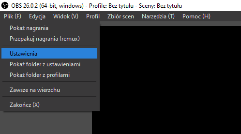
> 
> Plik $\rightarrow$ Ustawienia

## Zakładki/sekcje:

### 1. Wyjście

> 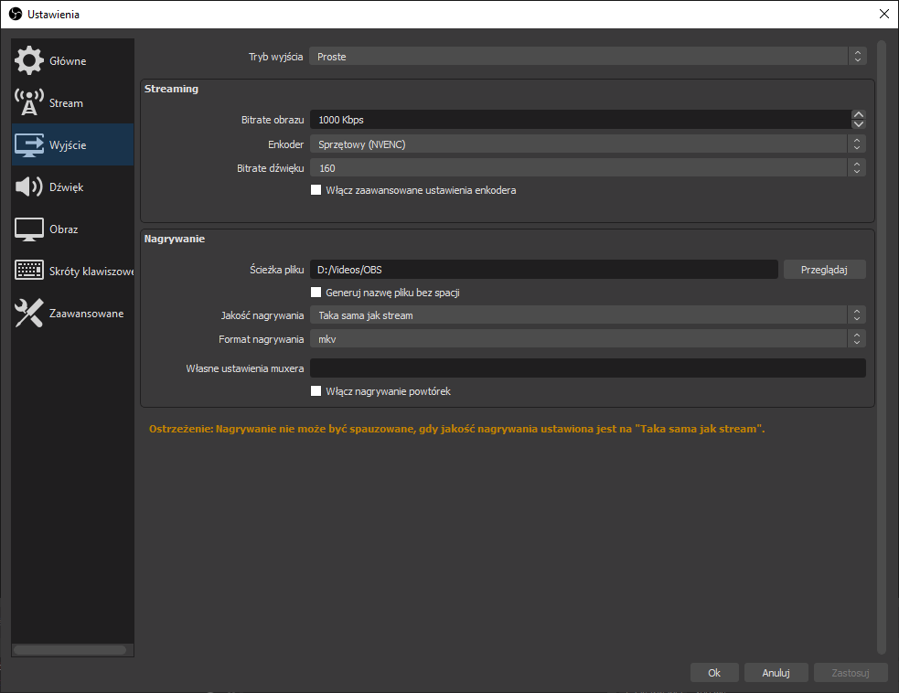
> Ustawienia $\rightarrow$ Wyjście
>
> Jesteśmy po multimediach więc czym jest **Bitrate obrazu** i **Bitrate dźwięku** tłumaczyć nie trzeba.
> 
> **Enkoder** to chyba tez oczywiste. Jak macie kartę Nvidia to klikać <u>NVENC</u> to będzie to lepiej działać, jak macie procki Intela 😔 to macie jeszcze opcje <u>Quick Sync</u>. Ja mam AMD więc nie mam.
>
> Dalej mamy tam pierdoły o zapisywaniu, format dajcie na **.mkv** (domyślny w sumie) no i ścieżka pliku tam dowolna w sumie, tylko aby było wiadomo gdzie te rzeczy się zapisują.
> 

### 2. Obraz
>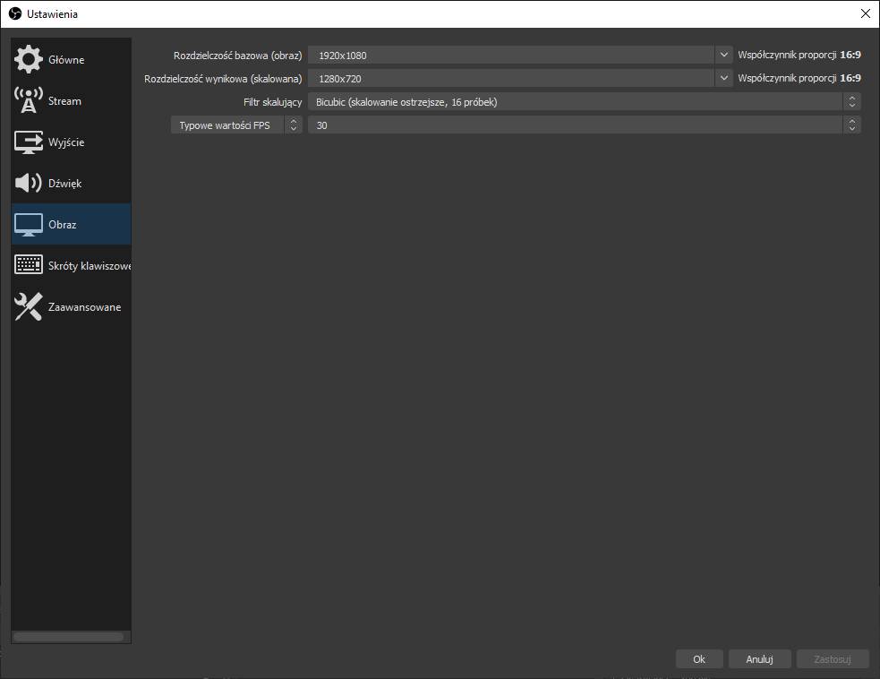
>Ustaw co tam chcesz tak naprawdę.

### 3. Dźwięk
> 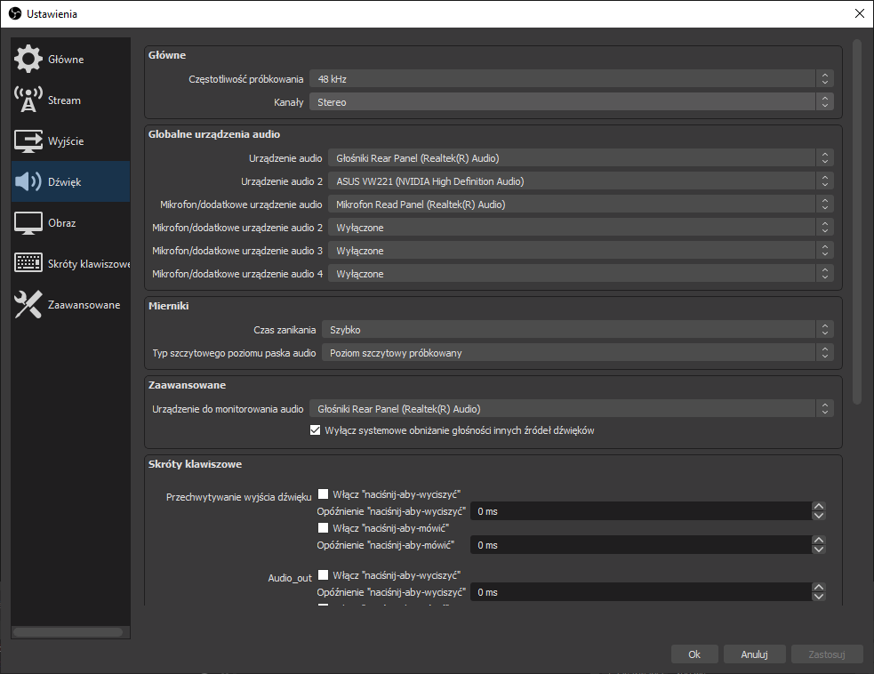
> Ustawienia $\rightarrow$ Dźwięk
>
> Urządzenia audio 1 i audio 2- myślę, że intuicyjne, możecie nic nie zaznaczać
>
> Mikrofon- jak wyżej
>
> ___
> Tutaj parę ważnych rzeczy trzeba zrobić, bo tutaj w sumie trzeba będzie ustawić opcje, że nie będzie na nagraniu dźwięku messangera/youtuba/gry
>
> Bajer polega na tym, że będziemy nasłuchiwać tego co dostaje OBS w tym przypadku będzie to dźwięk wykładu.
>
> Tutaj mamy dwie opcje, na czas wykładu siedzimy na słuchawkach albo głośnikach , a na drugim urządzeniu (głośnikach lub słuchawkach albo na wirtualnym urządzeniu audio np. [VB-cable](https://vb-audio.com/Cable/))w aplikacjach Zoom i Teams ustawiamu aby było wyjściem audio.
>
> #### Teraz coś ważniejszego I:
>
> Sekcja dumnie nazwana **Zaawansowane** gdzie wybieramy na czym chcemy posłuchać wykładu ale tak fizycznie, no z czego ma ten dźwięk lecieć, tak fizycznie xD Nie wiem jak to ładniej wytłumaczyć.
>
> Ja sobie tym często żongluję i wybieram raz słuchawki raz głośnik.
>
> No i nie wiem czy to jest domyślnie ale niech będzie **zaznaczone** pole **wyłącz systemowe obniżanie głośności** 
>
>
> #### Teraz coś ważniejszego II:
>
>
> Do ustawień wchodzimy Nasz awatar $\rightarrow$ Ustawienia
> (Tak wiem, że w Zoom można kliknąć pod awatarem zębatkę xD)
>
> 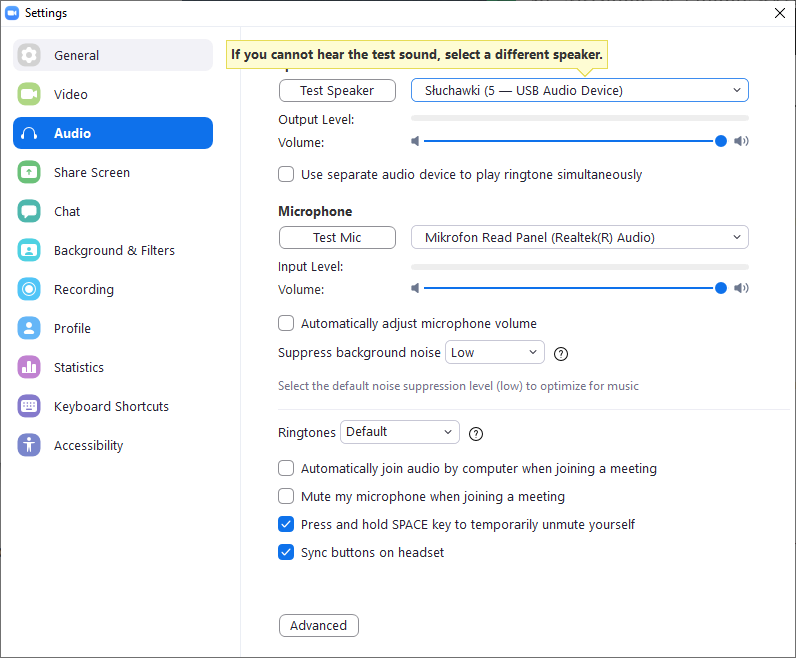
> 
> **Zoom** 
>
> 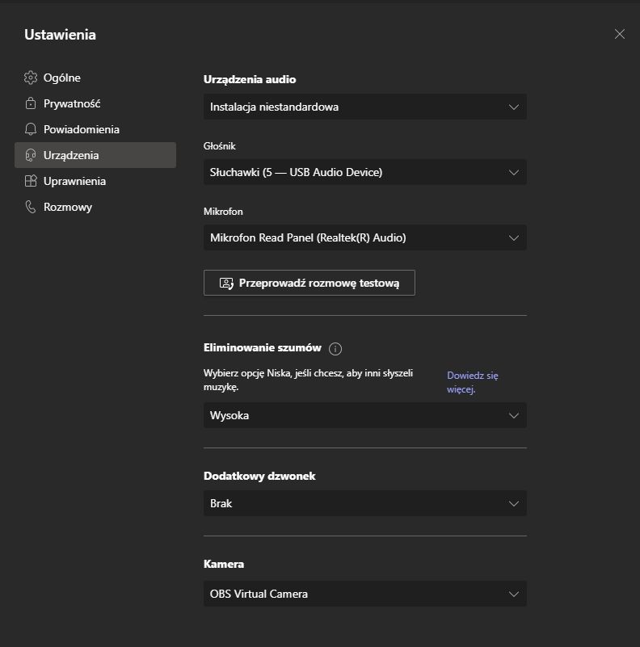
> 
> **MS Teams**
>
> Jak widać ja mam ustawione wyjście na kartę dźwiękową na USB, dlaczego? Bo mam i przynajmniej do czegoś się przyda, a nie mam już laptopa gdzie liczyłem każdy port USB jak drobne przed końcem miesiąca, ale wirtualne urządzenie audio też działa normalnie)
>
> 
### 3. Panel główny OBS
> #### Jak umiesz okno nagrać to pomiajasz
> Może nie każdy wie jak mieć ustawione okno w OBS do nagrywania, więc:
> 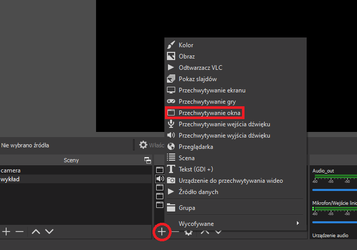
> 
> Okno, a nie ekran, bo inaczej nie bedzie sobie można wrzucić przeglądarki na ekran, a wiadomo, że są często ważniejsze rzeczy niż wykład.
>
> Potem wybieramy drobne pierdoły:
>
> (pole z nazwą tam zostawiamy co tam jest domyślne, jak nazwa nie pasuje można zmienić)
> 
> 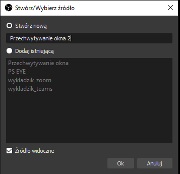
>
> Potem ustawiamy:
> 
> 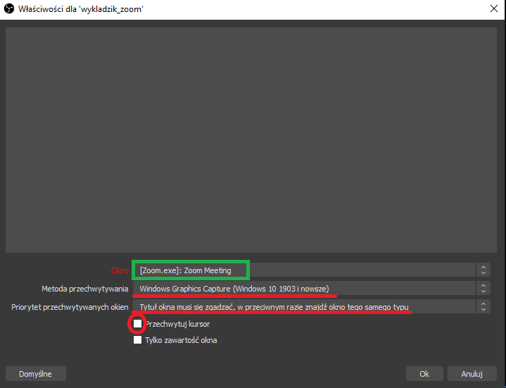
> 
> * Okno - chyba wiadomo (można przeklikać i w podglądzie będzie widoczne)
> * Metoda przechwytywania - u mnie działa ta co zaznaczona
> * Priorytet..... - to chyba nawet jest domyślnie
> * Przechwytuj kursor - wiadomo **odznaczamy**
> * Tylko zawartość okna - nie trzeba tłumaczyć, ja np. chcę mieć widoczny śmierdzący windowsowy pasek aplikacji
>
> Potem jak wybierzemy okno to **CTRL + f** ładnie nam okno dopasuje
>
> Do tego mała uwaga:
> Zoom ma **nie być w fullscreen** tylko jako okno i potem możecie kliknąć maksymalizuj (a to dwie różne rzeczy)
>
> No i wiadomo jak coś się źle kliknęło to double click na to i mamy menu do ustawiania.
>
> #### Witam tych co pomineli xD
>
> teraz ustawimy urządzenie audio, czyli ostatnia rzecz i można się rozejść
> 
> 
>
> * Teraz w zakładce **Źródła obrazu** dodajemy **Przechwytywanie źródła dźwięku**.
> * Nazwa dowolna (coś tam zaznaczone, domyślnie też jest)
> * 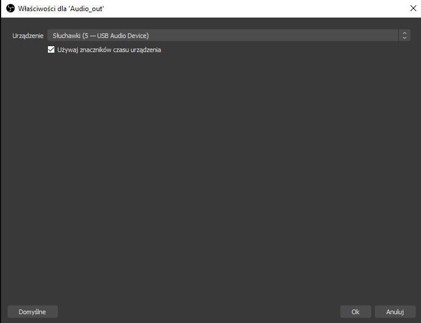
> Tutaj zaznaczamy to co zaznaczyliśmy w Teams i w Zoom w sensie to samo urządzenie audio
> * Ostatnia rzecz to nasłuchiwanie
> 
>   
>   
>   Prawym w sekcji mikser dźwięku i **Zaawansowane ustawienia dźwięku**
>   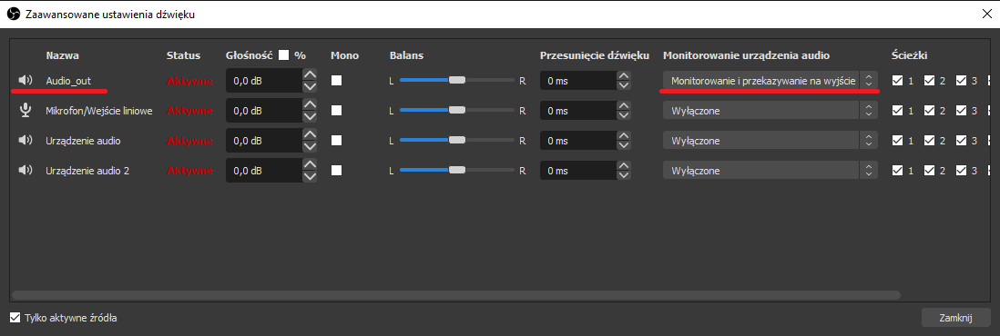
>   
>   Tutaj **Audio_out** to moja nazwa na **Przechwytywanie źródła dźwięku**, które dodawaliśmy wcześniej
>
### 4. Podsumowanie

> pozostałe źródła w sekcji **Mikser dźwięku** można wyciszyć
>
> Klikamy **Rozpocznij nagrywanie** i gotowe
>
> Mam nadzieję, że wszystko jasne, jak nie to pomęcz się sam albo napisz.

