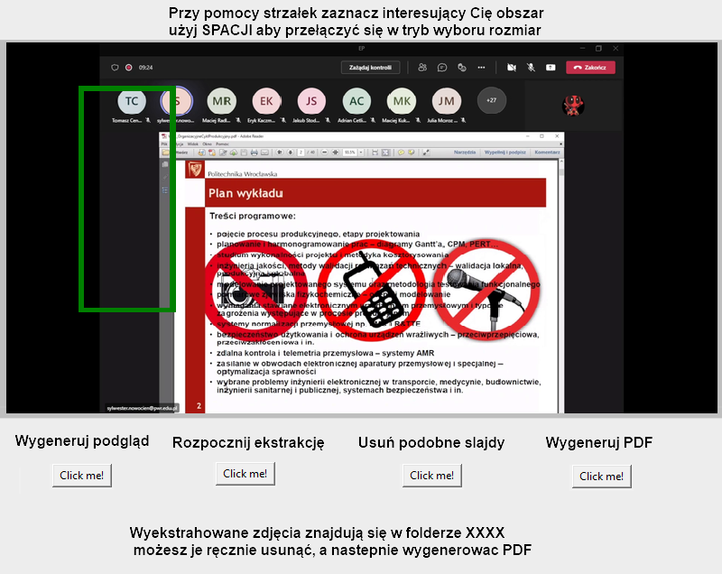

# Video2pdf

## Jeśli chcesz to tylko włączyć:

**Proszę przeczytaj notki zawierające się w tej podsekcji.**

### Opis działania przycisków

> **Wygeneruj podgląd** - wybierz plik wideo, który Cię interesuje, następnie zostanie wybrana losowa klatka z nagrania jako przykładowy podgląd
>
> **Rozpocznij ekstrakcję** - przy pomocy FFMPEG-a generowane są wycinki z filmów do folderu o nazwie pliku wideo
>
> **Usuń podobne slajdy** - porównywanie zdjęć i stworzenie kolejnego folderu z dopiskiem **_extracted**
>
> **Wygeneruj PDF** - wygenerowanie pliku PDF, o nazwie pliku wideo


### Zanim uruchomisz

- Upewnić się, że nie ma tam żadnych innych plików po poprzedniej konwersji (folderów ze zdjęciami)

- plik z nagraniem musi być w tym samym folderze co skrypt 

- plik *thumbnail.png* oraz *icon.ico* również

- trzeba mieć pobrane odpowiednie biblioteki:

   ```bash
    pip install sewar
    
    pip install opencv-python
    
    pip install ffmpeg-python
    
    pip install img2pdf
    
    pip install glob2
    
    pip install tk
    
    pip install Pillow
    
    pip install pytest-shutil
   ```

- oraz samego **ffmpeg**:
  - na windows: pobieramy to: [ffmpeg_binaries](https://www.gyan.dev/ffmpeg/builds/ffmpeg-git-full.7z)
    - wypakowywyjemy w sumie tylko zawartość pliku bin:
       
    - należy dodać do PATH ściezkę do ffmpeg-a
       
    - po wpisaniu w konsolę ` ffpeg` powinniśmy widzieć takie wyjście jak na zdjęciu wyżej


### Uruchomienie

- `python3 video2pdf.py`

- [wyskakuje okno programu] (trochę zajmuje samo uruchomienie)

- kliknij przycisk **Wygeneruj podgląd** i wybierz plik wideo

- okno programu się zamrozi, ponieważ teraz generowany jest podgląd

- powinien pojawić się podgląd

- przy pomocy strzałek należy wybrać obszar wycinania

- przy pomocy spacji można zmienić wielkość prostokątu

- nawet jeśli widoczny prostokąt przy pierwszym uruchomieniu akurat pasuje,to wypada goi tak przesunąć chociaż raz
  (po prostu ta pozycja jest zapisywana przy pierwszym wywołaniu funkcji od kliknięcia strzałki)

- następnie kliknij: **Rozpocznij ekstrakcję**

- znowu okno się zamrozi, trzeba poczekać (to trwa trochę długo, ale można podejrzeć na bieżąco zawartość folderu z wyeksportowanymi slajdami)

- kliknij **Usuń podobne slajdy** , znowu trzeba poczekać

- przejrzyj zawartość folderu *nazwa_pliku_extracted*

- usuń niepotrzebne slajdy, które program pominął

- kliknij **Wygeneruj PDF** 

- Potem można zrobić OCR na na stronie:

  > https://tools.pdf24.org/pl/ocr-pdf

- usuń powstałe pliki i przejdź do kolejnego nagrania

### Potencjalne problemy:

> podgląd wygenerował się niepoprawnie (można wybrać jeszcze raz ten sam plik i powinno wygenerować inną miniaturkę)
> albo zwiększyć okres w jakim ma być robiony podgląd, teraz jest ustawione kilka pierwszych minut
>
> na etapie **Rozpocznij ekstrakcję** w folderze nie ma wszystkich slajdów (jest zmienna fps =120, można ją zmniejszyć)


**I koniec, więcej nie potrzeba czytać**


## Jeśli chcesz ciut więcej:

### wymagania programu

film -> wybór obszaru cięcia -> zdjecia -> detekcja podbnych -> ręczne dopieszczenie -> generowanie PDF-a

Robione na **Python 3.10**

### to do:

- [x] porównywanie zdjęć miedzy sobą
- [x] eksport zdjęć z nagrania
- [x] problem z listą zdjęć
- [x] losowe zdjęcie z nagrania
- [x] gui
  - [x] ikonka piwa
- [x] ustawienie czułości dla slajdów
- [x] resize zdjęcia do wartości

____

- [x] resize zdjęcia o procent
- [x] pozycja kursora
- [x] wybór obszaru o screenshotowania
- [x] wybór pliku
- [x] zapis to folderu wybranych zdjęć

### plany na potem

- [ ] możliwość tłumaczenia (słownik z napisami w pliku na górze)
- [ ] repo po angielsku
- [ ] resizable
- [ ] **bold** tego co potrzeba
- [ ] requirements.txt do PIP-a
- [ ] plik wideo nie musi być w tym samym folderze co skrypt
- [ ] 


### notatki

zdjęcie z myszką w innym miejscu to podobieństwo na poziomie **0.9999388023849898**

a innego slajdu to około **0.8 - 0.9**


### linki

- https://www.binarystudy.com/2021/10/extracting-and-saving-video-frames-opencv-python.html
- https://www.youtube.com/watch?v=SWGd2hX5p3U 
- 

### GUI layout

>  
>
>  

### Usefull things:

> eksport do **.exe**
>
> `python3 -m PyInstaller --onefile main.py`
>
> rozkład poziomy:
>
> `object.pack(side=RIGHT, padx=50, pady=5)` 
>
> warstwy
>
> `widget.tkraise(aboveThis=ob)`
>
> przeskalowane zdjęcie
>
> `resized = image.resize((int(w/100*percent),int(h/100*percent)), Image.ANTIALIAS)` 
>
> pack z artybutami
>
> ` button1.pack(anchor = S,side=LEFT, padx=5, pady=0)` 
>
> button
>
> ```python
> button1 = Button(root, text="Click", width=10)
> # click_button.grid(row=1,column=0)
> button1.config(command=lambda: click_action(button1,"button"))
> # button1.pack(anchor = S,side=LEFT, padx=5, pady=0)
> button1.grid(row = 3, column= 0, pady=20)
> ```
>
> label
>
> ``` python
> text1 = Label(root, font=10, text="Wygeneruj podgląd",pady=20)
> # text.pack(anchor= N,side=LEFT, padx=5, pady=0)
> text1.grid(row = 2, column= 0)
> ```
>
> 
>
> ```python
> def makescreen(x1 = 0 ,y1= 0,x2=1600,y2=1200,monitor_number = 3):
> 
>  sct = mss.mss()
>  # Get information of monitor 2
> 
>  mon = sct.monitors[monitor_number]
> 
> 
>  # The screen part to capture
>  monitor = {
>      "top": mon["top"] + y1,  # 100px from the top
>      "left": mon["left"] + x1,  # 100px from the left
>      "width": x2,
>      "height": y2,
>      "mon": monitor_number,
>  }
>  # output = "sct-mon{mon}_{top}x{left}_{width}x{height}.png".format(**monitor)
>  # str(monitor["mon"])
> 
>  #set the output name
>  output = "screenshot_"+ time.strftime('%Y_%m_%d_%H_%M_%S', time.localtime()) +".png"
> 
>  # Grab the data
>  sct_img = sct.grab(monitor)
> 
>  # Save to the picture file
>  #mss.tools.to_png(sct_img.rgb, sct_img.size, output=output)
>  print(output)
> 
> 
> 
> 
>  img3 = numpy.array(sct_img)
> 
>  img3 = numpy.delete(img3,3,2)
> 
> 
> 
>  img1 = cv2.imread("./img4.png",1)
>  img2 = cv2.imread("./img2.png",1)
> 
> 
>  #print(img3)
> 
>  print(uqi(img1,img3,8))
> ```
>
> 
>
> 
>
> 
>
> 
>
> 
>


### Actual window

 


### PIP install

reguirements.txt will be in the future

```bash
pip install sewar

pip install opencv-python

pip install ffmpeg-python

pip install img2pdf

pip install glob2

pip install tk

pip install Pillow

pip install pytest-shutil


```


